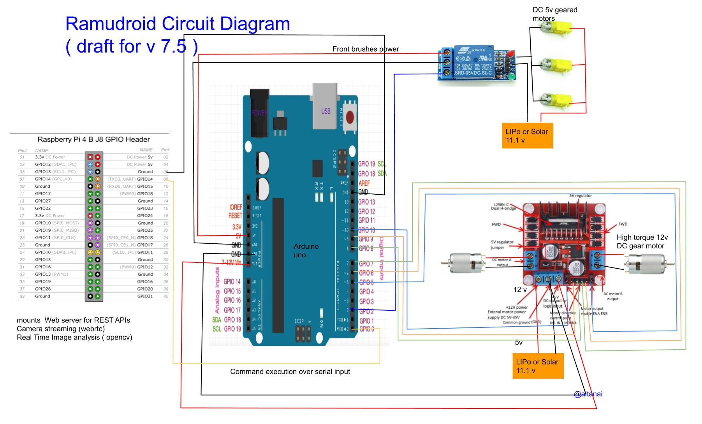

Project “Ramudroid” is designed to use computer vision and autonomous robots to target litter and clean roadsides for keeping the locality clean. 
The hardware assembly is designed to drive through roads / lanes / alleys / narrows pathways and lift up small litter objects like plastic cups, wrappers, leaves etc.

It's got wireless connectivity. 

There's a camera for real-time image sensing of the environment

[](https://gitter.im/altanai/m2mcommunication?utm_source=badge&utm_medium=badge&utm_campaign=pr-badge&utm_content=badge)

## Ramudroid's Hardware 



List of components 

### Processing and MicroController

**Raspberry Pi 3B+/4 as Central Processing Unit**
- runs webservices to receive remote navigation command
- runs uv4l streaming server for webrtc 
- opencv remote object identification 

**Arduino Uno as Microcontroller**
- receives commands from Rpi on serial interface
- control motors for movement and cleaning

### Driving Unit 

**Pi NoIR Camera V2**
Object and obstacle detection , uses Sony IMX219 8-megapixel sensor
accessed through the MMAL and V4L APIs,

**motor driver**
L298 Motor Driver 

**power**
Lipo batteru 11.1 V or Solar Panel connection 12 V

### Cleaning Unit 

**brushes motor**
3 x 5V DC gear motor  

**relay**
5V single channel relay

**power**
Lipo battery 11.1 V or Solar Panel connection 12 V


#### IR sensor to detect if garbage collection bin/tray is full
infrared radiation can be found between the visible and microwave regions, wavelengths between 0.75 and 1000µm.

## Software 

Following are the modular components of the project :

### 1. m2m-communication communication 

Communication between the web client , mobile client , cloud server and robot's  core unit is primarily on REST API's.
Communication techniques used in the project are as follows 

For external world 
- Wifi
- BLE

For inter-components 
- GPIO
- UART 
- I2C


### 2. Computer Vision, object tracking, realtime video analysis

To effectively limit the usage of power on frontal clenaing brushes, it is crucial to target garbage/litter and active the motors only when suited target is found. 
Implementing edge image analysis based on opencv filters and classifiers to detect garbage

Ref : https://github.com/altanai/computervision
https://github.com/altanai/opencv_extra

### 3. Live streaming and augmented reality

https://youtu.be/O7b6NlOpLso

### 4. Robot's core control unit


Connecting Motors, drivers , sensors , batteries etc and controlling operation 

GPIO access library written in C for the BCM2835 used in the Raspberry Pi
```
git clone git://git.drogon.net/wiringPi
cd wiringPi
git pull origin
cd wiringPi
./build
gpio -v
gpio readall
```

### 5. Web Console for Ramudroid


**Contributing guidelines**

https://github.com/altanai/Ramudroid/wiki/Contributing-Guidelines

**External References and Resources**

Hackaday : https://hackaday.io/project/11201-ramudroid

JigsawAcdemy : https://youtu.be/49dtFYhxmjc

## Version

- Ramudroid v5
    - Autonomous navigation with GPS
    https://altanaitelecom.wordpress.com/?s=Bot+to+clean+roads+and+outdoors
    
- Ramudorid v6 
    - Enhancement to autonomous navigation 
    - Sensors addons - rain , ultrasonic 
    - Web console enhanced. 
    
- Ramudroid v6.5
    - Minimize usage of heavy libraries such as three.js for Augmented reality, google maps for GPS coordinates plotting 
    - Autonomous control to the robot to self drive through obstacles.
    - Edge analytics on Obstruction and recalculate the route.
    
- Ramudorid v7 Surajdroid ( Ramudroid v7 Solar Powered) 

    https://telecom.altanai.com/2018/12/09/surajdroid-ramudroid-v7-solar-powered/

- Ramudorid v7.5 Surajdroid  
    
    https://telecom.altanai.com/2018/12/09/surajdroid-ramudroid-v7-solar-powered/


## Author 


**License**
MIT
