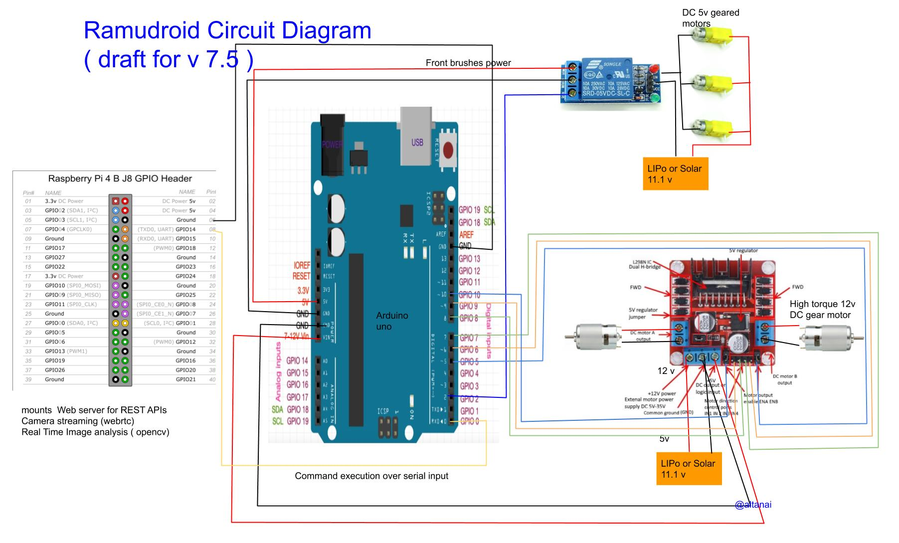

# RamuDroid


RamuDroid is an open-source autonomous outdoor garbage-picking robot that combines robotics, IoT connectivity, and computer vision to detect and collect litter from roadsides and public outdoor spaces.

Project links:

- GitHub Pages: https://altanai.github.io/Ramudroid/
- Original innovation page: https://altanai.github.io/Ramudroid/original-innovation
- Repository: https://github.com/altanai/Ramudroid

[](https://gitter.im/altanai/m2mcommunication?utm_source=badge&utm_medium=badge&utm_campaign=pr-badge&utm_content=badge)

## What RamuDroid Does

- Drives through roads, lanes, alleys, and narrow pathways
- Uses camera-based sensing to detect litter
- Triggers cleaning operation based on detection
- Supports remote monitoring and control through web services

## Hardware Overview



### Processing and control

- Raspberry Pi 3B+/4 as central processor
    - Runs web services for remote navigation and control
    - Runs streaming stack (UV4L/WebRTC setups by version)
    - Runs computer vision processing
- Arduino Uno as microcontroller
    - Receives control commands from Raspberry Pi over serial
    - Controls motors and sensor-level operations

### Driving unit

- Pi NoIR Camera V2 (Sony IMX219 8MP)
- L298 motor driver
- 11.1V LiPo battery or 12V solar panel input

### Cleaning unit

- 3 x 5V DC gear motors for brush assembly
- 5V single-channel relay
- 11.1V LiPo battery or 12V solar panel input
- IR sensor to detect collection bin/tray fullness

## Software Architecture

Key communication model:

- External: WiFi, BLE
- Inter-component: GPIO, UART, I2C
- Application control: REST APIs


### Main modules in this repository

- `gps_navigation/` - GPS and path navigation related notes/code
- `robot_controller_rpi_setup/` - Raspberry Pi setup and control scripts
- `robot_mcu_arduino_uno_setup/` - Motor controller and Arduino-side firmware
- `self_driving_rpi_robot/` - Self-driving model training/inference resources
- `sensors/` - Sensor integrations (including ultrasonic)
- `webrtc_stream_objectdetection/` - WebRTC streaming and object detection stacks
- `webservices_rpi_arduino_comm/` - Service layer for RPi-Arduino communication

## Getting Started

### 1. Clone the repository

```bash
git clone https://github.com/altanai/Ramudroid.git
cd Ramudroid
```

### 2. Install Python dependencies

```bash
pip install -r requirements.txt
```

### 3. Explore module-specific setup guides

- `robot_controller_rpi_setup/README.md`
- `webrtc_stream_objectdetection/README.md`
- `webservices_rpi_arduino_comm/README.md`
- `self_driving_rpi_robot/README.md`

### 4. Optional: install `wiringPi` for low-level GPIO utilities

```bash
git clone git://git.drogon.net/wiringPi
cd wiringPi
git pull origin
./build
gpio -v
gpio readall
```

## Version Highlights

- v5
    - Autonomous navigation with GPS
    - https://altanaitelecom.wordpress.com/?s=Bot+to+clean+roads+and+outdoors
- v6
    - Enhanced autonomous navigation
    - Sensor additions (rain, ultrasonic)
    - Improved web console
- v6.5
    - Reduced heavy AR/map dependencies
    - Better obstacle handling and route recalculation
    - Edge analytics improvements
- v7 (Surajdroid)
    - Solar-powered focus
    - https://telecom.altanai.com/2018/12/09/surajdroid-ramudroid-v7-solar-powered/
- v7.5+
    - Continued optimization of autonomy and CV pipelines

## External References

- Telecom tag archive: https://telecom.altanai.com/tag/ramudroid/
- Devpost: https://devpost.com/software/ramudroid-g37oar
- Medium publication: https://medium.com/ramudroid
- Hackaday project: https://hackaday.io/project/11201-ramudroid
- Surajdroid (Hackaday): https://hackaday.io/project/173801-surajdroid
- Demo video: https://youtu.be/O7b6NlOpLso

## Contributing

- Contributing guidelines: https://github.com/altanai/Ramudroid/wiki/Contributing-Guidelines

## Author

- Altanai: https://www.linkedin.com/in/altanai

## License

MIT
