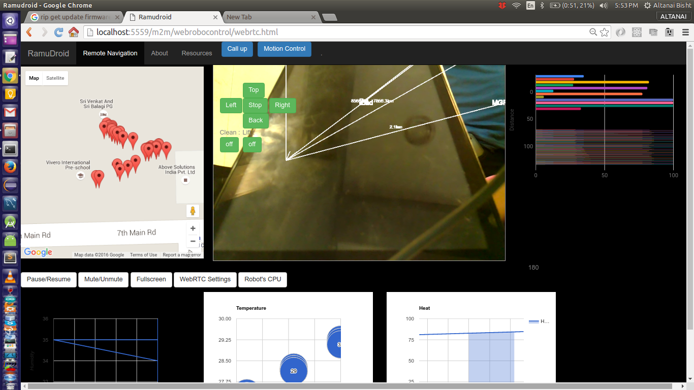

# GPS Navigation for Ramudroid

Street View


Satellilte view 

 
## Position fetch from chrome browser geolocation API
getting position 
```
navigator.geolocation.getCurrentPosition(showPosition);
```

## Sample Data points 
Starting point - 30.2891177,78.05377020000002
--tbd
Endpoint - 