# RamuDroid

RamuDroid is an open-source autonomous outdoor garbage-picking robot project combining robotics, IoT, and computer vision.

This GitHub Pages site has been refreshed with content from:

- Project repository source (README.md and module docs)
- Archive material from G:\My Drive\Ramudroid
- Original innovation document from G:\My Drive\VISA H1B O1 EB1\EB1\Original work\Robot_Ramudroid

---

## Mission

Project RamuDroid is designed to detect litter and clean roadsides and outdoor/public environments using autonomous robotic systems. The hardware and software are designed for lanes, roadsides, and narrow paths where small litter objects (cups, wrappers, leaves) can be identified and collected.

---

## Original Innovation

This work has evolved through multiple versions (v1.0 to v8+), including advances in:

- Autonomous navigation and obstacle handling
- CV-based litter detection (HAAR to CNN evolution)
- Solar-powered and battery-backed operation
- Real-time telemetry and WebRTC-based streaming

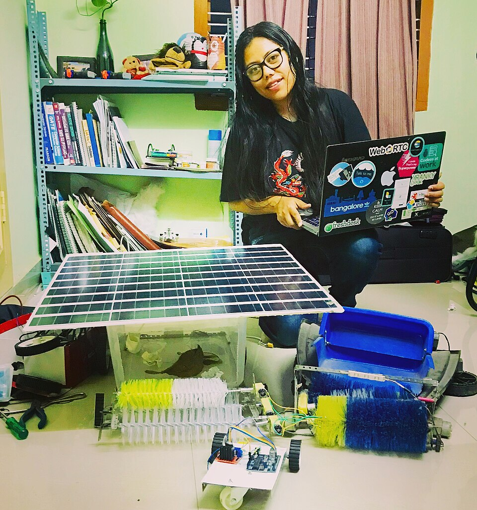

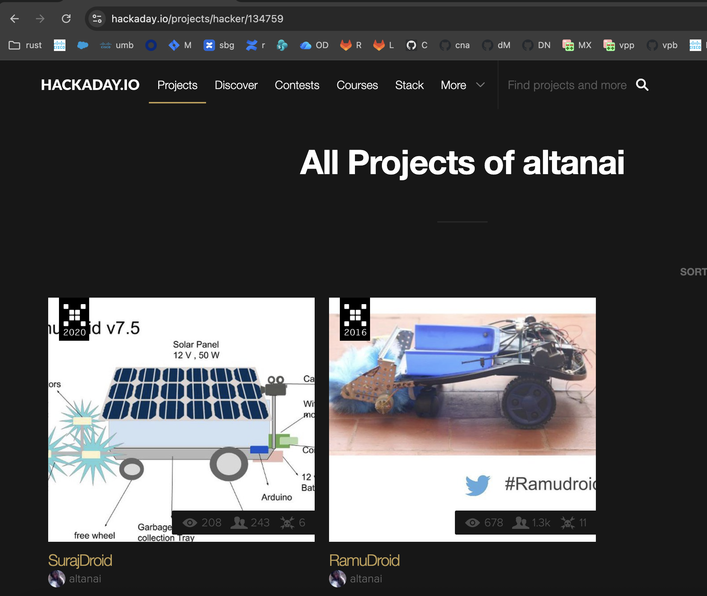

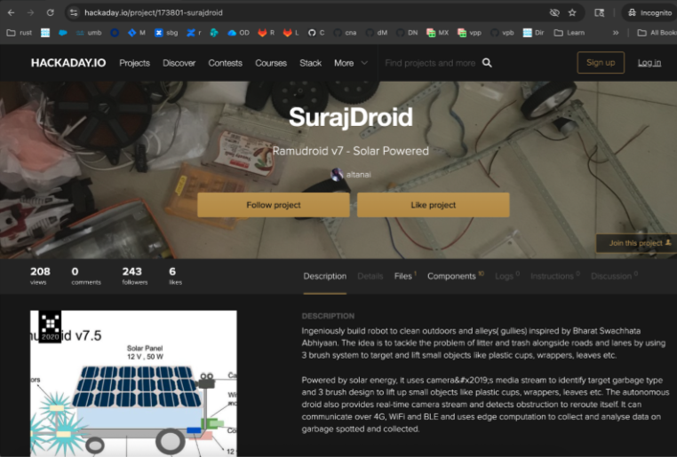

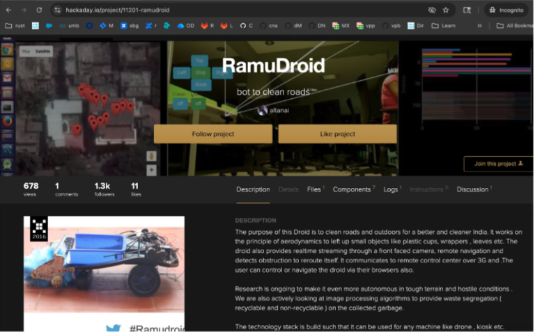

Detailed narrative and version history:

- [RamuDroid Original Innovation Notes](original-innovation.md)

---

## Technical Architecture

### Core hardware

- Raspberry Pi 3B+/4 for web services, CV processing, and streaming
- Arduino Uno for motor control and low-level sensor handling
- Pi Camera (NoIR / V2) for real-time image sensing
- L298 motor driver and DC motors for mobility and cleaning
- IR, ultrasonic, and weight sensors for obstacle/bin state awareness

### Communication model

- External communication: WiFi, BLE, LTE/4G (by generation)
- Internal communication: GPIO, UART, I2C
- Control and integration: REST APIs and local controller interfaces

### Software modules

- Robot control and motor orchestration
- Sensor ingestion and event-driven operations
- Computer vision pipelines for object/litter detection
- WebRTC live-streaming and dashboard/console interfaces

---

## Repository Modules

- `gps_navigation/`
- `robot_controller_rpi_setup/`
- `robot_mcu_arduino_uno_setup/`
- `self_driving_rpi_robot/`
- `sensors/`
- `webrtc_stream_objectdetection/`
- `webservices_rpi_arduino_comm/`

Source repository:

- https://github.com/altanai/Ramudroid

---

## Archive Snapshot (My Drive)

The Drive archive includes presentations, whitepapers, diagrams, media captures, and design notes used across RamuDroid versions and demonstrations.

Representative archive items include:

- `Autonomous Navigation for robot Ramudroid - whitepaper.gdoc`
- `Ramudroid v8 Garbage Picking Crypto Mining Robot for Precycle.gdoc`
- `RamuDroid Brief Summary.gdoc`
- `Ramudroid Competitor Research.gdoc`
- `Ramudroid circuit diagram.gdraw`
- `RamuDroid v8 Architecture diagram.gdraw`
- `Final IOT webRTC app Technical Deck.gslides`
- `IEDF Microsoft Ramudroid.gslides`

---

## Archive Image Gallery (G:\My Drive\Ramudroid)

Additional snapshots and artifacts from the Ramudroid Drive archive:

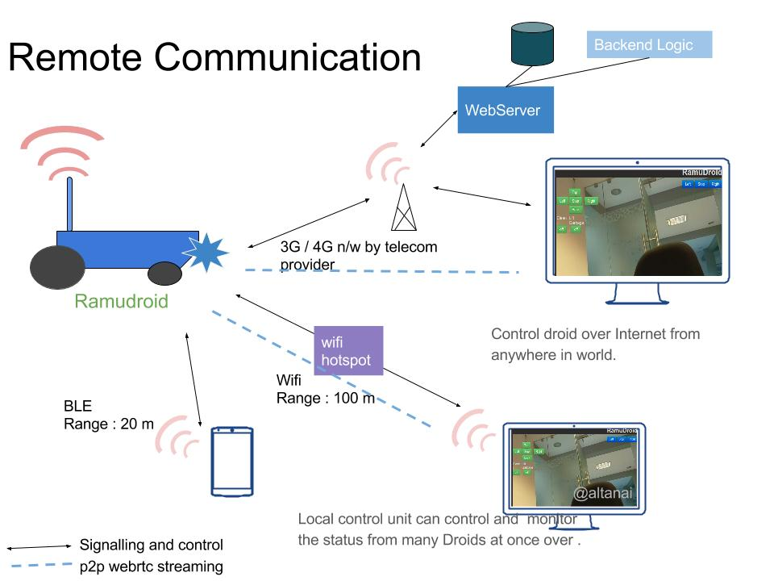

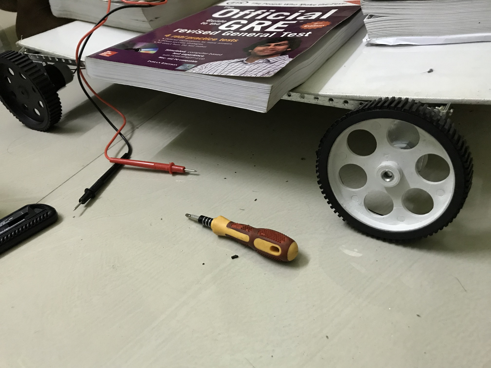

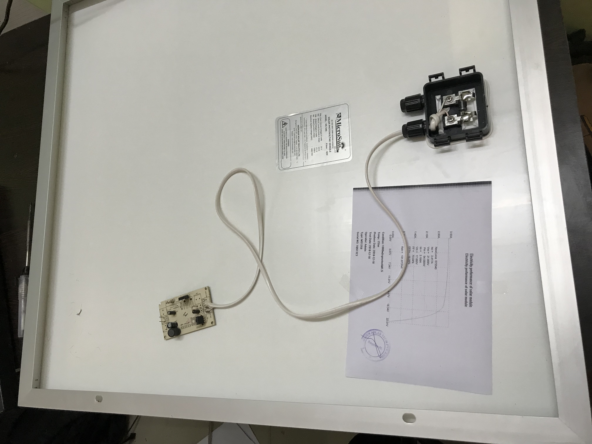

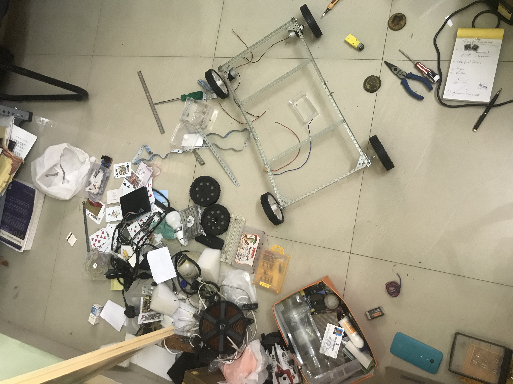

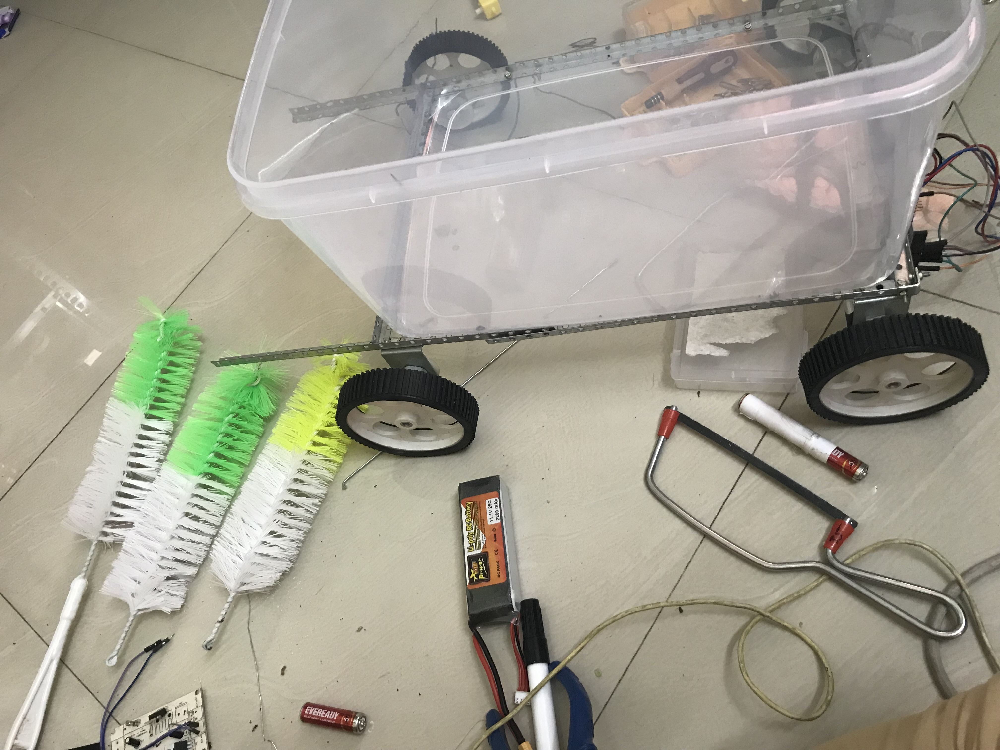

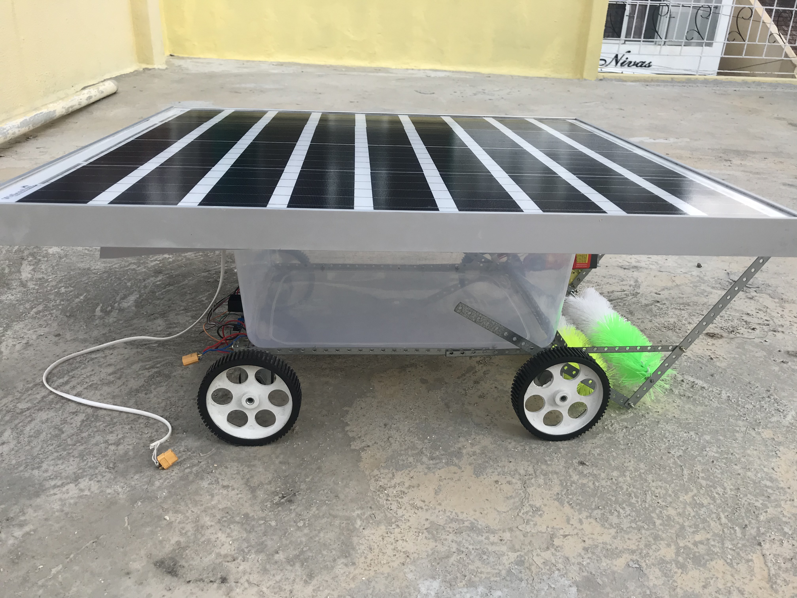

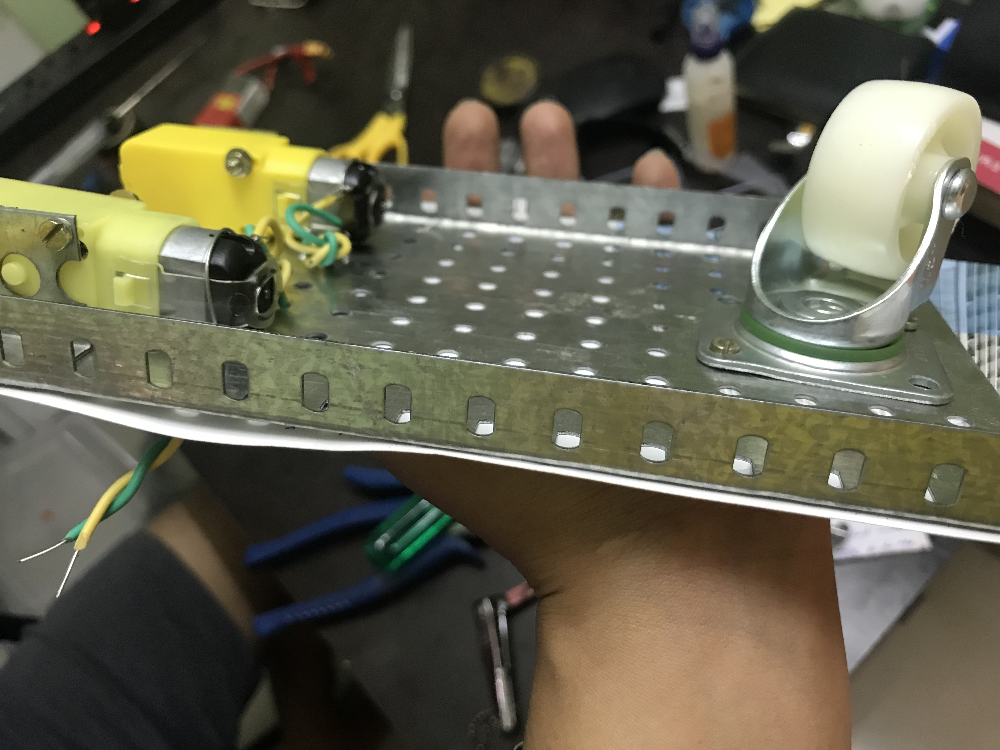

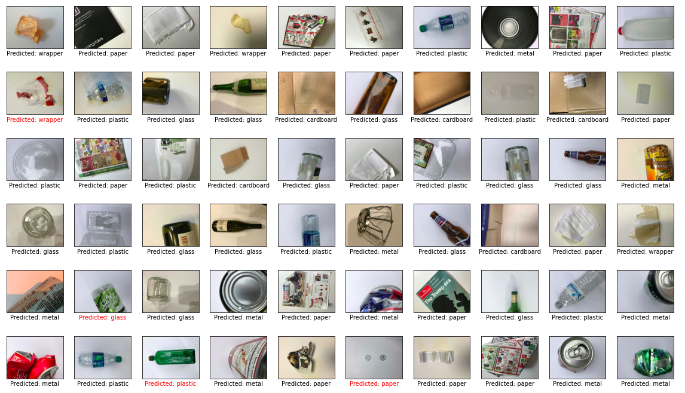

---

## External References

- Telecom tag archive: https://telecom.altanai.com/tag/ramudroid/
- Devpost project: https://devpost.com/software/ramudroid-g37oar
- Medium: https://medium.com/ramudroid
- Hackaday v1-v6: https://hackaday.io/project/11201-ramudroid
- Surajdroid v7: https://hackaday.io/project/173801-surajdroid
- Telecom article: https://telecom.altanai.com/2018/12/09/surajdroid-ramudroid-v7-solar-powered/

---

## License

MIT
