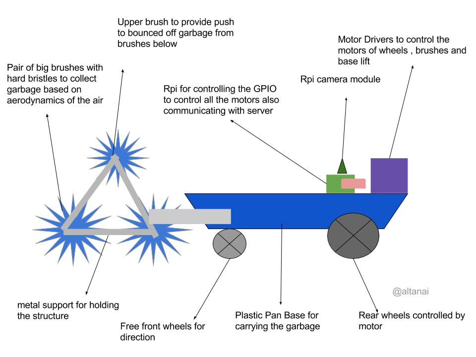
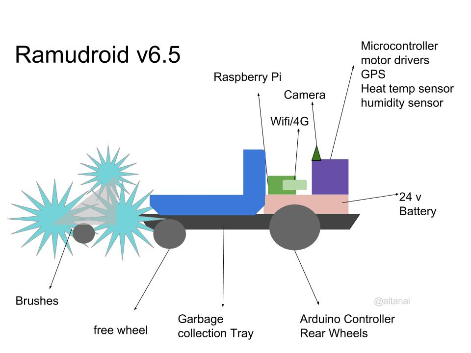
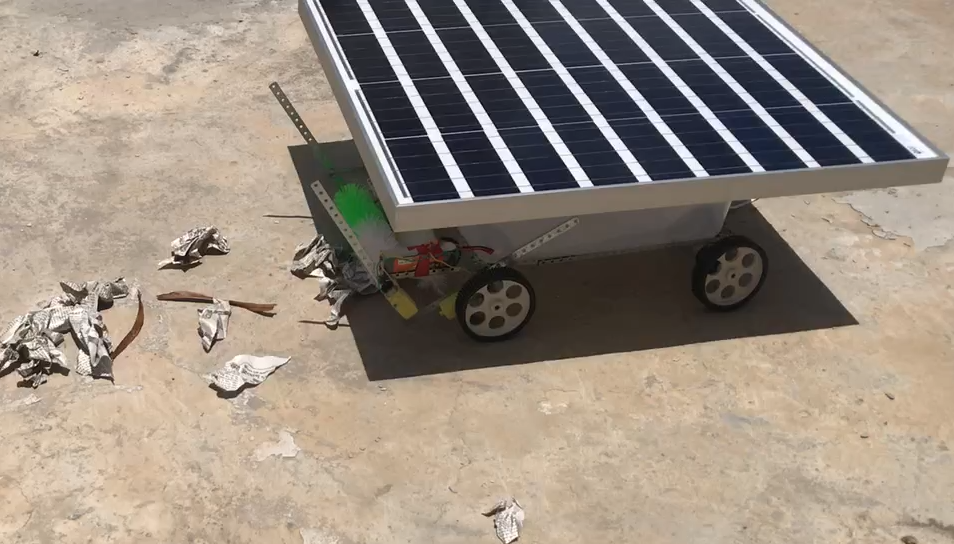
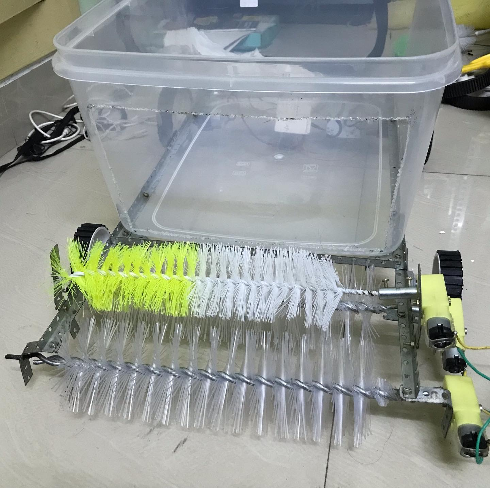
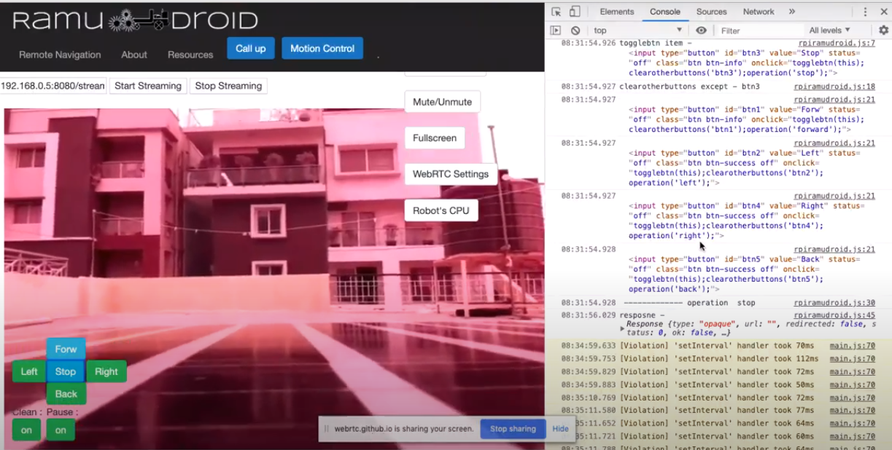
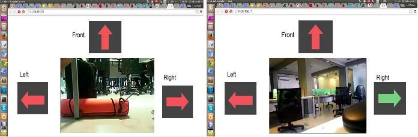
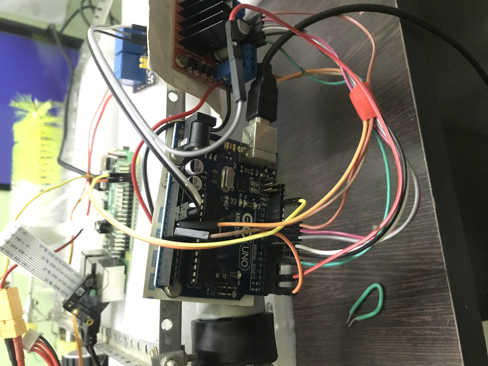
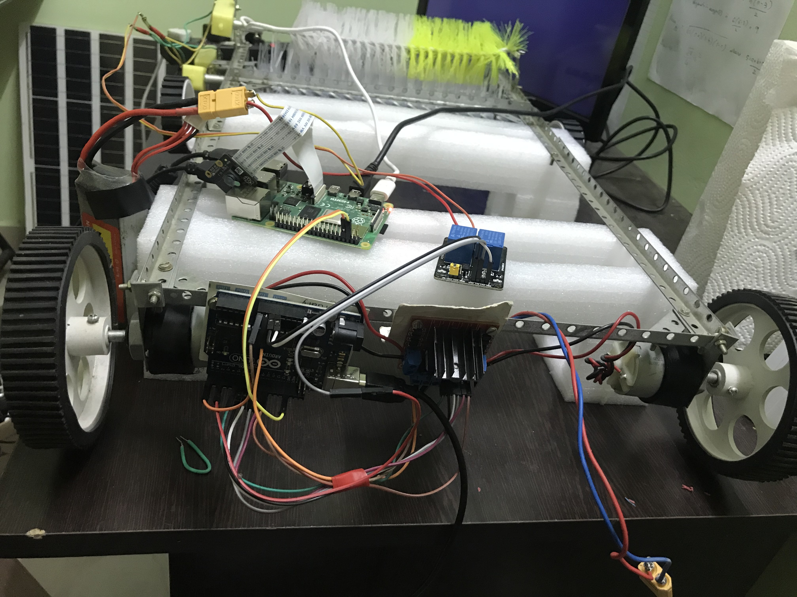
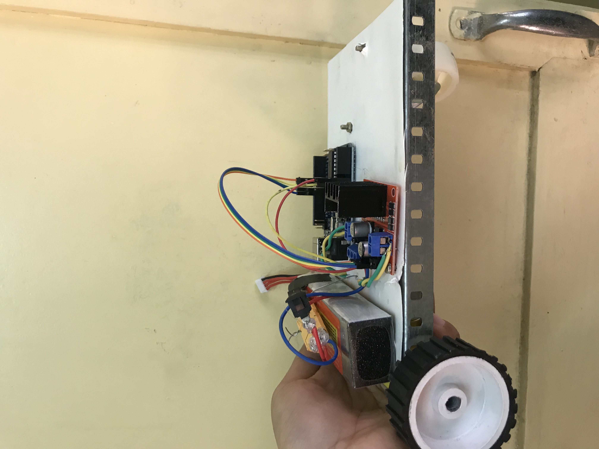
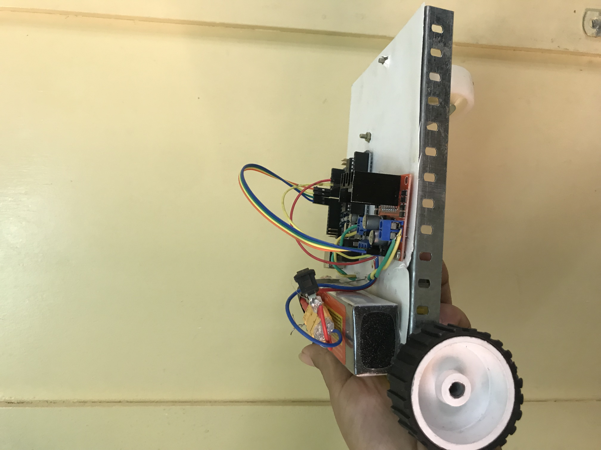

# RamuDroid

**Autonomous Outdoor Garbage-Picking Robot**

An open-source robotics project combining computer vision, IoT connectivity, and solar power to autonomously detect and collect litter from streets, alleys, and public spaces. Designed, engineered, and iterated through 8+ versions by [Altanai Bisht](https://www.linkedin.com/in/altanai) since 2014.

[View Source on GitHub](https://github.com/altanai/Ramudroid){: .btn }  [Read the Innovation Story](original-innovation.md){: .btn }

---

## The Problem

Urban litter in streets, alleys, and public spaces is a persistent environmental and public health challenge worldwide. Manual cleanup is labor-intensive and inconsistent. RamuDroid was conceived to automate this — an autonomous robot that identifies trash, navigates to it, and collects it without human intervention.

## The Solution

RamuDroid is a battery and solar-powered wheeled robot that:

- **Sees** — camera-based computer vision detects and classifies litter in real time
- **Navigates** — autonomous path planning with GPS waypoints and obstacle avoidance
- **Cleans** — three motorized rotating brushes sweep debris into an onboard collection bin
- **Reports** — live WebRTC video stream and telemetry dashboard for remote monitoring

---

## Evolution: A Decade of Engineering (2014–Present)

Each version introduced substantial hardware and software advances:

| Version | Year | Key Engineering Milestones |
|---------|------|---------------------------|
| **v1.0** | 2014 | First prototype — basic frame, remote-controlled DC motor drive, manual brush activation |
| **v3.0** | 2017 | Added Pi Camera streaming, built first web dashboard for remote monitoring |
| **v5.0** | 2018 | Redesigned chassis for better terrain handling, integrated ultrasonic sensors for obstacle detection |
| **v6.5** | 2019 | Autonomous routing with edge-computed obstacle avoidance, HAAR cascade garbage detection |
| **v7.0 "Surajdroid"** | 2020 | Solar panel integration (12V 60Wp), IR bin-full sensor, weight sensor, autonomous brush triggering on CV detection |
| **v7.5** | 2020 | Refined power management, improved autonomous cleaning cycle, conference demos |
| **v8.0+** | 2021+ | CNN-based litter classification replacing HAAR cascades, TensorFlow Lite on-device inference, enhanced autonomy |

---

## System Architecture

### Hardware Platform

<table>
<tr><th>Subsystem</th><th>Components</th><th>Role</th></tr>
<tr><td><strong>Compute</strong></td><td>Raspberry Pi 3B+/4</td><td>Web services, CV processing, WebRTC streaming, ML inference</td></tr>
<tr><td><strong>Control</strong></td><td>Arduino Uno</td><td>Motor control, sensor polling, serial command interface</td></tr>
<tr><td><strong>Vision</strong></td><td>Pi NoIR Camera V2 (Sony IMX219, 8MP)</td><td>Real-time image capture for object detection and streaming</td></tr>
<tr><td><strong>Drive</strong></td><td>2× 12V DC motors (~300 RPM) + L298 driver</td><td>4-wheel differential drive (rear powered, front free-rolling)</td></tr>
<tr><td><strong>Cleaning</strong></td><td>3× 5V DC gear motors (60 RPM) + relay</td><td>Three rotating brushes — two frontal sweep inward, one pushes to bin</td></tr>
<tr><td><strong>Sensing</strong></td><td>Ultrasonic, IR, weight sensors</td><td>Obstacle avoidance, bin-full detection, load monitoring</td></tr>
<tr><td><strong>Power</strong></td><td>12V 60Wp solar panel + 11.1V 2200mAh Li-ion</td><td>Solar-primary with battery backup, charge controller managed</td></tr>
</table>

### Communication Stack

<table>
<tr><th>Layer</th><th>Protocols</th></tr>
<tr><td>External (to cloud/user)</td><td>WiFi, BLE, LTE/4G, WebRTC</td></tr>
<tr><td>Internal (board-to-board)</td><td>GPIO, UART (serial), I2C</td></tr>
<tr><td>Application control</td><td>REST APIs, WebSocket events</td></tr>
</table>

### Computer Vision Pipeline

The CV system evolved across versions:

1. **v5–v6** — OpenCV HAAR cascades for basic object detection
2. **v6.5** — Refined classifiers for garbage vs. non-garbage filtering
3. **v7+** — Edge analytics with selective brush activation (power optimization)
4. **v8+** — TensorFlow Lite CNN models for real-time litter classification on-device

Brush motors are activated only when a valid litter target is detected, reducing unnecessary power draw — a key innovation for solar-powered operation.

---

## Software Modules

The codebase is organized into focused modules, each independently documented:

| Module | Purpose |
|--------|---------|
| [`robot_controller_rpi_setup/`](https://github.com/altanai/Ramudroid/tree/master/robot_controller_rpi_setup) | Raspberry Pi configuration, GPIO setup, streaming server |
| [`robot_mcu_arduino_uno_setup/`](https://github.com/altanai/Ramudroid/tree/master/robot_mcu_arduino_uno_setup) | Arduino motor controller firmware (C) |
| [`webrtc_stream_objectdetection/`](https://github.com/altanai/Ramudroid/tree/master/webrtc_stream_objectdetection) | WebRTC streaming + object detection stacks (UV4L, OpenCV, TFLite) |
| [`webservices_rpi_arduino_comm/`](https://github.com/altanai/Ramudroid/tree/master/webservices_rpi_arduino_comm) | Flask-based web services bridging RPi ↔ Arduino |
| [`self_driving_rpi_robot/`](https://github.com/altanai/Ramudroid/tree/master/self_driving_rpi_robot) | Self-driving model training and inference |
| [`sensors/`](https://github.com/altanai/Ramudroid/tree/master/sensors) | Ultrasonic and other sensor integrations |
| [`gps_navigation/`](https://github.com/altanai/Ramudroid/tree/master/gps_navigation) | GPS waypoint navigation |

---

## Build Gallery

### Robot Assembly and Field Testing

### Prototypes Across Versions

### Earlier Prototypes and Demos

---

## Live Demos

- **RamuDroid v7 (Surajdroid) — Solar powered autonomous operation:**  
  [https://youtu.be/O7b6NlOpLso](https://youtu.be/O7b6NlOpLso)

- **RamuDroid v1 — First prototype movement test:**  
  [https://youtu.be/iZzjLxmx0D8](https://youtu.be/iZzjLxmx0D8)

- **RamuDroid v5 — Navigation improvements:**  
  [https://youtu.be/KzfTfvDlvSM](https://youtu.be/KzfTfvDlvSM)

- **RamuDroid v6.5 — Autonomous cleaning demo:**  
  [https://youtu.be/wHQMVP_WOLs](https://youtu.be/wHQMVP_WOLs)

- **RamuDroid v8 — CNN-based detection:**  
  [https://youtu.be/UDFjFlcZjJg](https://youtu.be/UDFjFlcZjJg)

---

## Conference Presentations and Recognition

RamuDroid has been presented at major conferences and innovation platforms:

- **Grace Hopper Celebration (2016)** — Presented to 20,000+ attendees
- **Women in Robotics Conference (2021)**
- **Microsoft IEDF**
- **Git Commit Show (2019)** — Technical showcase with live demonstration
- **BarCamp Bangalore** — Community demo and talk
- **PreCycle Innovation Challenge** — Selected participant
- **Google Developer Student Clubs Solution Challenge (2022)** — Submission
- **Atal Innovation Mission** — Presented Ramudroid v7.5
- **Seattle University Open Day** — Live demonstration (featured in Seattle Spectator)

---

## Publications, Articles, and Whitepapers

- Autonomous Navigation for Robot Ramudroid — whitepaper
- Trash Detection, Classification and Tagging on WebRTC Stream for Robotic Retrieval
- Litter Picking Robot Design and Operation Using Hybrid Solar Energy
- Garbage Picking Robot RamuDroid's Autonomous Navigation — project report
- RamuDroid v8: Garbage Picking Crypto Mining Robot for Precycle

---

## External References and Press

| Platform | Link |
|----------|------|
| **Telecom Engineering Blog** | [telecom.altanai.com/tag/ramudroid](https://telecom.altanai.com/tag/ramudroid/) |
| **Devpost** | [devpost.com/software/ramudroid-g37oar](https://devpost.com/software/ramudroid-g37oar) |
| **Medium Publication** | [medium.com/ramudroid](https://medium.com/ramudroid) |
| **Hackaday (v1–v6)** | [hackaday.io/project/11201](https://hackaday.io/project/11201-ramudroid) |
| **Hackaday Surajdroid (v7)** | [hackaday.io/project/173801](https://hackaday.io/project/173801-surajdroid) |
| **Surajdroid Technical Article** | [telecom.altanai.com — Surajdroid v7](https://telecom.altanai.com/2018/12/09/surajdroid-ramudroid-v7-solar-powered/) |
| **InvideLabs Feature** | [Tech Talk: How I Built an Autonomous Cleaning Robot](https://blog.invidelabs.com/tech-talk-how-i-built-an-autonomous-cleaning-robot-showcase/) |
| **InvideLabs Showcase** | [Ramudroid Showcase by Altanai](https://blog.invidelabs.com/tech-talk-ramudroid-showcase-altanai/) |
| **Wikimedia Commons** | [Photo of Altanai with Ramudroid robots](https://commons.wikimedia.org/wiki/File:Ramudroid%27s_founder_Altanai.jpg) |

> "Ramudroid is an eco-conscious, solar-powered robot that uses real-time image processing and WebRTC-based streaming to detect litter and clean autonomously." — **InvideLabs Tech Talk**

---

## About the Engineer

**Altanai Bisht** — Robotics engineer and creator of RamuDroid. Conceptualized, designed, and built every version of this robot from 2014 to present, covering mechanical design, embedded firmware, computer vision algorithms, power systems, and IoT connectivity.

- LinkedIn: [linkedin.com/in/altanai](https://www.linkedin.com/in/altanai)
- GitHub: [github.com/altanai](https://github.com/altanai)

---

## License

Open source under the [MIT License](https://github.com/altanai/Ramudroid/blob/master/LICENSE).
